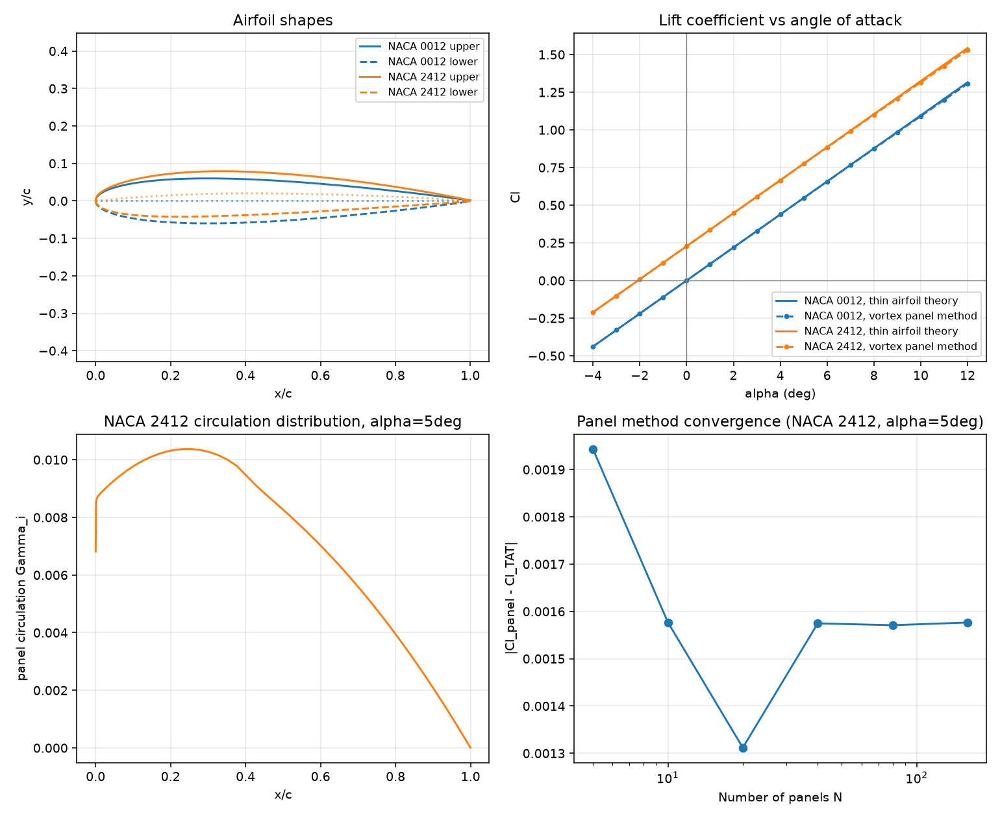

# Airfoil Aerodynamics Analyzer

A Python tool that predicts an airfoil's lift using **two independent numerical/analytic methods**, cross-checked against each other and against known textbook values. Pure aerospace-engineering fundamentals — no libraries beyond NumPy/Matplotlib, no shortcuts.

---

## What it does

Given a NACA 4-digit airfoil code (e.g. `2412`), it:

1. Generates the airfoil's geometry — camber line and full upper/lower surface coordinates
2. Predicts lift coefficient (Cl) vs angle of attack via **classical thin airfoil theory** (the closed-form Glauert/Fourier solution)
3. Predicts the same thing independently via a **discrete vortex panel method** on the camber line (the "1/4–3/4 rule," also called Weissinger's method)
4. Compares the two, plots airfoil shapes, lift curves, an approximate loading distribution, and a convergence study

Two methods that agree, computed two different ways, is stronger evidence of correctness than one method alone — the same principle used throughout this portfolio (the [rocket simulator](../rocket-ascent-sim/README.md)'s tests, the [satellite tracker](../satellite-ground-track/README.md)'s pre-verification).

---

## The two methods

**Thin airfoil theory** — the textbook analytic result. Represents the camber line as a Fourier series in the transformed coordinate `x = c/2·(1−cos θ)`, and derives the zero-lift angle, lift coefficient, and moment coefficient in closed form. Its central result — a lift-curve slope of exactly `2π` per radian, independent of camber — is one of the most famous results in aerodynamics.

**Discrete vortex panel method** — a numerical alternative. The camber line is broken into N panels; each panel gets an unknown point vortex at its quarter-chord location, and the boundary condition (no flow through the surface) is enforced at each panel's three-quarter-chord point. Solving the resulting linear system for the vortex strengths gives the total circulation, and lift follows directly from the Kutta-Joukowski theorem: `L' = ρ·V∞·Γ`.

Both operate on the camber line only — this is the classical **thin-airfoil approximation**. Neither method captures how airfoil *thickness* shapes the actual pressure distribution (that requires a full surface panel method, a legitimate next step but out of scope here — stated honestly, not glossed over).

---

## Verification

Before any of this was wired into plots, the core math was checked against known values in a standalone script:

| Check | Result | Expected |
|---|---|---|
| Flat plate (NACA 0000) lift-curve slope | exactly matches | `Cl = 2π·α` (radians) — the textbook limiting case |
| NACA 2412 zero-lift angle | −2.077° | Literature value: approximately −2.0° to −2.1° |
| NACA 2412 lift-curve slope | 6.2832/rad (0.1097/deg) | `2π`/rad — universal result, independent of camber |
| Panel method vs. thin airfoil theory, flat plate | within 0.01 | Should closely agree — flat plate is the simplest case |
| Panel method vs. thin airfoil theory, NACA 2412, α = −2° to 10° | within 0.02 across the sweep | Two independent methods, same physical answer |
| Panel method convergence (N = 5 → 160) | stabilizes at a small residual (~0.0016), doesn't diverge | Expected: the two methods are genuinely different discretizations, so a small persistent gap — not exact equality — is the correct outcome |

All 15 checks are also codified as `pytest` tests (`test_aero.py`), not just one-off prints — they run every time the project is touched.

---

## Running it

```bash
pip install -r requirements.txt

python run.py          # generates plots/airfoil_analysis.png, prints a summary
pytest test_aero.py -v # 15 tests
```

## Sample output

```
NACA 0012
  Zero-lift angle: -0.00 deg
  Lift-curve slope: 2*pi/rad = 6.2832 (universal, thin airfoil theory)
  At alpha=5deg: Cl (thin airfoil theory) = 0.5483, Cl (panel method) = 0.5476

NACA 2412
  Zero-lift angle: -2.08 deg
  Lift-curve slope: 2*pi/rad = 6.2832 (universal, thin airfoil theory)
  At alpha=5deg: Cl (thin airfoil theory) = 0.7761, Cl (panel method) = 0.7745
```



Top-left: airfoil cross-sections (NACA 0012 symmetric, NACA 2412 cambered). Top-right: lift curves from both methods — note the two NACA 2412 curves run parallel to NACA 0012's, offset by camber, confirming the "universal `2π` slope, camber shifts the curve" result. Bottom-left: an approximate spanwise-loading proxy from the panel method's circulation distribution. Bottom-right: the panel method's error against thin airfoil theory, stabilizing rather than diverging as panel count increases.

---

## Files

- `airfoil.py` — NACA 4-digit geometry: camber line, thickness distribution, full surface coordinates
- `aero.py` — both lift-prediction methods
- `run.py` — demo: analyzes NACA 0012 and NACA 2412, generates the comparison plot
- `test_aero.py` — 15 pytest tests against known values and cross-method agreement
